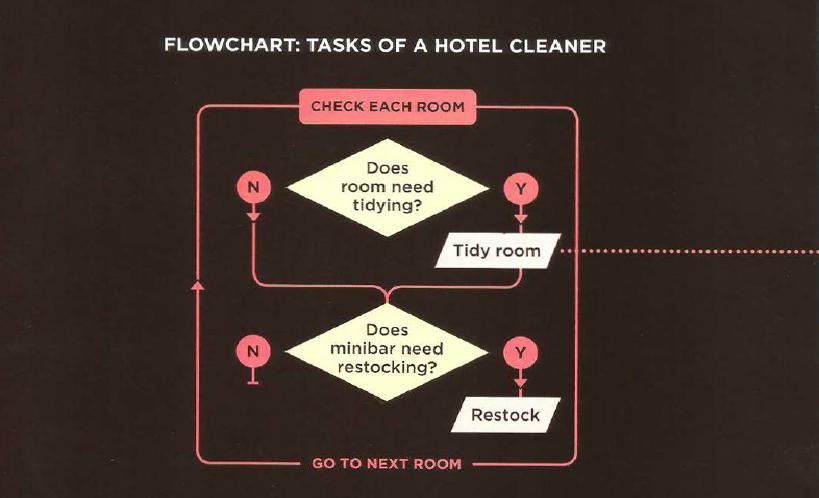
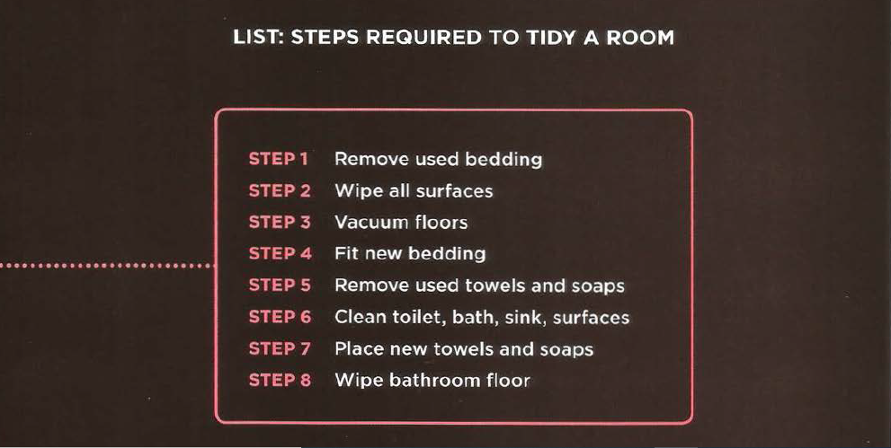
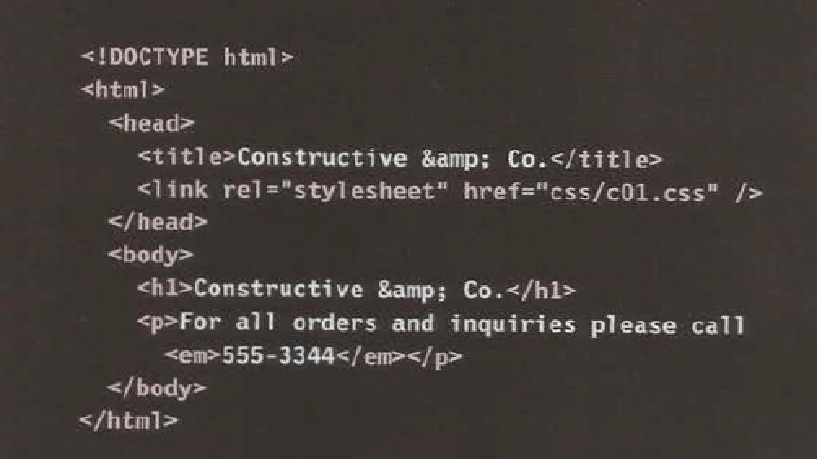
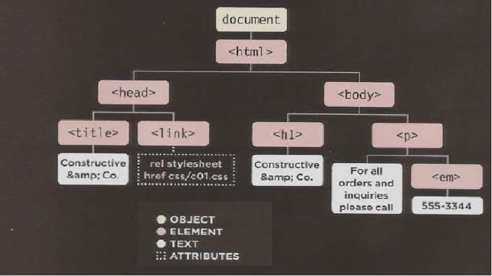

# **Introductory HTML and JavaScript**
* ### How People Access The Web ? 
  * 1- **Browsers** : People access websites using software called a web browser. Popular examples include Firefox, Internet Explorer, Safari, Chrome, and Opera.
  * 2- **Web Servers** : When you ask your browser for a web page, the request is sent across the Internet to a special computer known as a web server which hosts the website.
  * 3- **Devices** :  desktop computers, laptops, tablets, and mobile phones.
  * 4- **Screen readers** : are programs that read out the contents of a computer screen to a user. They are commonly used by people with visual impairments.

## ***All websites use HTML and CSS, but content management systems, blogging software, and e-commerce platforms often add a few more technologies into the mix.***
###### 
## **How the Web Works ?**

* ### **DOCTYPES** tell browsers which version of HTML you are using.

* ### **HTML Comment** 

* ### The **id** and **class** attributes allow you to identify particular elements.

* ### The **div** and **span** elements allow you to group block-level and inline elements together.

* ### **iframes** cut windows into your web pages through which other pages can be displayed.

* ### The **meta** tag allows you to supply all kinds of information about your web page.

* ### **Escape characters** are used to include special characters in your pages

# **HTML5 Layout**
  * ### Traditional HTML Layouts
    - web page authors used 
 elements to group together related elements
    - Authors used class or id attributes to indicate the role of the 
 element in the structure of the page.
    
  * ### New Html5 Layout Elements
    - HTML5 introduces a new set of elements that allow you to divide up the parts of a page. The names of these elements indicate the kind of content you will find in them. They are still subject to change, but that has not stopped many web page authors using them already.
    - figre below show html5 layout elements
    

    | tag | Description |
    | ----| ----------- |
    | <header> |  Defines a header for a document or a section |
    | <nav> | Defines a set of navigation links |
    | <section> | Defines a section in a document |
    | <article> | Defines an independent, self-contained content |
    | <aside> | Defines content aside from the content (like a sidebar) |
    | <footer> | Defines a footer for a document or a section |
    | 
 | Defines additional details that the user can open and close on demand |
    | 
 | Defines a heading for the details element |

    - The new HTML5 elements indicate the purpose of different parts of a web page and help to describe its structure.
    - The new elements provide clearer code (compared with using multiple 
 elements).
    - Older browsers that do not understand HTML5 elements need to be told which elements are block-level elements.
    - To make HTML5 elements work in Internet Explorer 8 (and older versions of IE), extra JavaScript is needed, which is available free from Google.
# **Process and Design**
 *  ### 1- Site Map
    The aim is to create a Site Map
    of the pages that will be used
    to structure the site. figure1 show the example of Site Map
     
    * *figure1 : Example of Site Map*

  * ### 2- WireFrames
    A wireframe is a simple sketch of the key information that needs to go on each page of a site. It shows the hierarchy of the information and how much space it might require. Figure2 is show example of WireFrames
    
    * *Figure2:Example of WireFrames*
  * ### 3- Visual Design
    The primary aim of any kind of visual design is to communicate. Organizing and prioritizing information on a page helps users understand its importance and what order to read it in.The Visual hierarchyand Design NaVigation are Examples of Visual Design 

     * ### Visual hierarchy
     You can use contrast to create a visual hierarchy that gets across your key message and helps users find what they are looking for.
      * Visual hierarchy Components
        1- Size
        2- Color
        3- Style
    * ### Designing Navigation
     Site navigation not only helps people find where they want to go, but also helps them understand what your site is about and how it is organized.Good navigation tends to follow these principles. 
        1- Concise
        2- Clear
        3- Selective
        

* # Structure
   * HTML Languege describes the structure of pages
   * HTML uses elements to describe the structure of Pages. the elements of HTML called **Tags** ex 

.
   * Attributes tell  more about elements. example 
Paragraph in English

   * HTML Structure show in figure bellow 
   
   * the tools to write html code is text editor or online editor 
   *To learn more about HTML visit [W3Schools website](https://www.w3schools.com)

# **key concepts in computer programming**
  * ### 1- What is a script and how do I create one? 
    A ***script*** is a series of instructions that a computer can follow to achieve a goal. 

    script are made up of instruction a computer can follow step-by-step.
    A browser may use different parts of the script depending on how the user interacts with the web pages.
    script can run different sections of the code in response to the situation around them.

    *To write a script, you need to first state your goal and then list the tasks that need to be completed in order to achieve it.*

    * ### 1-	 Define the goal
    you need to define the task you want to achieve. You can think of this as a puzzle for the computer to solve.

    * ### 2-	 Design  the script
    To design a script you split the goal out into a series of tasks that are going to be involved in solving this puzzle. This can be represented using a flowchart. You can then write down individual steps that the computer needs to perform in order to complete each individual task (and any information it needs to perform the task), rather like writing a recipe that it can follow.
    * #### Designing Script task: this step is achived by flowchart for example :
      

    * #### Design script steps to translate them into lines of code. ex :
    

    * ### 3-	Code  each  step 
    Each of the steps needs to be written in a programming language that the computer understands. In our case, this is JavaScript.

  * ### 2- How do computers fit in with the world around them? 
    * #### **Objects (Things)**
       In computer programming, each physica l thing in the world can be represented as an object. Programmers might say that there is one instance of the object. Each object can have its own: properties , events and  methods

    * #### **properties (characteristics)**
      Programmers call these characteristics the properties of an object. Each property has a name and a value, and each of these name/value pairs tells you something about each individual instance of the object.
    * ### **Event**
      An event is the computer's way of sticking up its hand to say, "Hey, this just happened!"
       * ######  **What  Does an  Event Do ?**
          - Programmers choose which events they respond to. When a specific event happens, that event can be used to trigger a specific section of the code.

          - Scripts often use different events to trigger different types of functionality.

          - So a script will state which events the programmer wants to respond to, and what part of the script should be run when each of those events occur.
    * ### **Methods**
       **Methods** typically represent how people (or other things) interact with an object in the real world.
     * ***They are like questions and instructions that:***
          -  Tell you something about that object (using information stored in its properties)
          -  Change the value of one or more of that object's properties
    * **What Does a Method Do?**
        - The code for a method can contain lots of instructions that together represent one task.
        - When you use a method, you do not always need to know how it achieves its task; you just need to know how to ask the question and how to interpret any answers it gives you.
  ### ***Computers use data to create models of things in the real world. The events, methods, and properties of an object all relate to each other: Events can trigger methods, and methods can retrieve or update an object's properties***
  
 * ### 3- How do I write a script for a web page?
    * **How A browser sees a web pages?**
      * 1- Receive  a page as HTML code
        
      * 2- Create  a model  of  the  page and  store it in memory 
        
      * 3-	Use a rendering engine to  show the page on screen 
      

# HOW HTML, CSS, & JAVASCRIPT FIT TOGETHER
* ## Progressive Enhancement
  1- HTML only
  2- HTML + CSS
  3- HTML + CSS + JavaScript
## Creating a Basic JavaScript 
 - #### Code below is a basic JavaScript 
   

  - #### Linking to a javascript file from an HTML page in this html tag
    *<script src="js/ add-content.js"></ script>*
  - #### The best palce to put scripts in their own files is the end of the body 
  - A script is a series of instructions that a computer can follow one-by-one. Each individual instruction or step is known as a **statement**. 
  - *Statements should end with a semicolon*.
  - writting comments to explain what your code does.They help make your code easier to read and understand. This can help you and others who read your code.
    * Tow ways to write comment 
      * 1- // for single line
      * 2- */*  */* for multi line
  - A script will have to temporarily store the bits of information it needs to do its job. It can store this data in **variables**.
  - A **variable** is a good name for this concept because the data stored in a variable can change (or vary) each time a script runs
  - The variable decleration is as this
    ***var x;***
  - The variable Assigning is as  this  ***x=3;***
  -JavaScript distinguishes between numbers,strings, and true or false values known as Booleans.
      * 3 is a number
      * 'Ahmed' is a strings
      * Boolean is a true or false

  * A variable name in JavaScript 
      * 1- must be started with a letter.
      * 2- can contain letters,numbers, dollar sign ($), or an underscore (_). Note that you must not use a dash(-) or a period (.) in a variable name.
      * 3- should not be ***keyWord*** such as ***if***
      * 4-is the case sensetive: so score and Score would be different variable names, but it is bad practice to create two variables that have the same name using different cases.  

