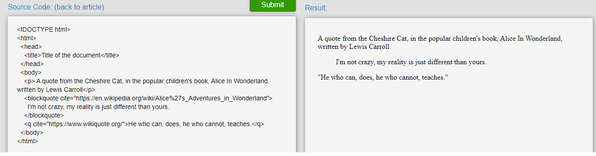
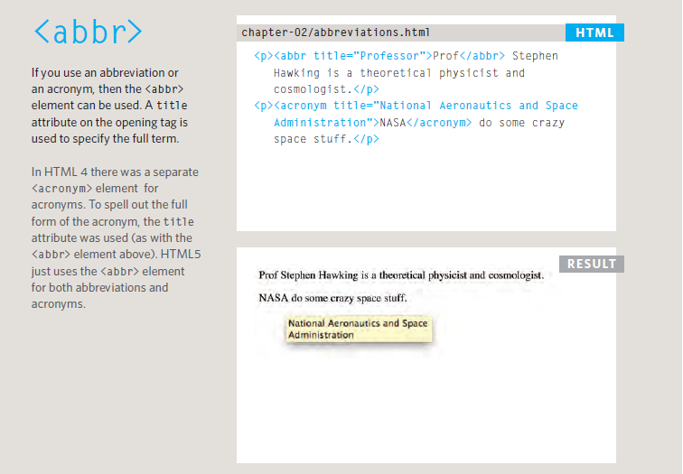
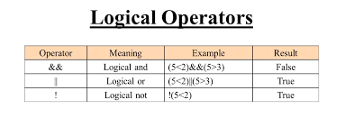

# **Basics of HTML, CSS & JS**
# **HTML Text**
* ## **Headings and paragraphs**
    - ### **HTML Headings**
    
    - ### **HTML paragraphs**
    

* ## **Bold, italic, emphasis**
    - 
    - ##### **Examples**
    - 
    

* ## **Structural and semantic markup**
    - ##### **Breake line and Horizontal Rules**
      
      
    - ##### **block quotes and quotes**
    
    - ##### **Abbreviations and Acronyms**
    
    - ##### **Cite and Definitions**
    
    - ##### **Address**
    
# **What CSS does?**
  * #### CSS allows you to create rules that specify how the content of an element should appear.
  * #### CSS allows you to create rules that control the way that each individual box (and the contents of that box) is presented.
# ** How CSS works?**
* ## css associates rules
  * 1-CSS syntax follows a simple rule-set that consists of two principles: CSS selectors and declaration blocks.

  * 2-CSS is for assigning certain values to properties. In other words, CSS tells the browser which fonts, colors, decorations, or other features HTML elements use. 

  

* ## Using External CSS
  With an external style sheet, you can change the look of an entire website by changing just one file!
  

* ## Using Inernal CSS
  An internal style sheet may be used if one single HTML page has a unique style. The internal style is defined inside the style tag element, inside the head section.
  

* ## Types of CSS selectors
  There are many different types of CSS selector that allow you to target rules to specific elements in an HTML document.
  
* ## How Css Rules Cascade
  The CSS Cascade is the algorithm by which the browser decides which CSS styles to apply to an element

* ## CSS Inheritance
  In CSS, some styles are inherited down the HTML document tree while others are not. While this can be confusing, the principle behind it is actually designed to allow to write fewer CSS rules.
  
  for examole 
  
## Creating a Basic JavaScript 
 - #### Code below is a basic JavaScript 
   

  - #### Linking to a javascript file from an HTML page in this html tag
    *<script src="js/ add-content.js"></ script>*
  - #### The best palce to put scripts in their own files is the end of the body 
  - A script is a series of instructions that a computer can follow one-by-one. Each individual instruction or step is known as a **statement**. 
  - *Statements should end with a semicolon*.
  - writting comments to explain what your code does.They help make your code easier to read and understand. This can help you and others who read your code.
    * Tow ways to write comment 
      * 1- // for single line
      * 2- */*  */* for multi line
  - A script will have to temporarily store the bits of information it needs to do its job. It can store this data in **variables**.
  - A **variable** is a good name for this concept because the data stored in a variable can change (or vary) each time a script runs
  - The variable decleration is as this
    ***var x;***
  - The variable Assigning is as  this  ***x=3;***
  -JavaScript distinguishes between numbers,strings, and true or false values known as Booleans.
      * 3 is a number
      * 'Ahmed' is a strings
      * Boolean is a true or false

  * A variable name in JavaScript 
      * 1- must be started with a letter.
      * 2- can contain letters,numbers, dollar sign ($), or an underscore (_). Note that you must not use a dash(-) or a period (.) in a variable name.
      * 3- should not be ***keyWord*** such as ***if***
      * 4-is the case sensetive: so score and Score would be different variable names, but it is bad practice to create two variables that have the same name using different cases.  
## **Arrays**
  An array is a special type of variable. It doesn't
just store one value; it stores a list of values.
  * ### how to create array in javascript
  

  - Values in an array are accessed as if they are in a numbered list. It is important to know that the numbering of this list starts at zero (not one).
 # **Expression**
An expression evaluates into (results in) a single value. Broadly speaking there are two types of expressions.
  * 1- Expression that just assign a value to a variable:ex 
  *var color = 'beige';*
  
  * 2- Expression  that use two  or more values ro return a single value.EX:
   *var area = 3 * 2;*

# **Operators**
Expressions rely on things called operators; they allow programmers to create a single value from one or more values.
 
  

* ***There is just one string operator: the+ symbol. It is used to join the strings on either side of it (concatenation).***

# **Decision Making**
  * ***Decision making*** is the process of making choices by identifying a decision, gathering information, and assessing alternative resolutions.

  * ## Evaluation of Condition and Conditional Statement
  

  ## **How can Evaluate Condition?**

A comparison operator compares its operands and returns a logical value based on whether the comparison is true. The operands can be numerical, string, logical, or object values. Strings are compared based on standard lexicographical ordering, using Unicode values. In most cases, if the two operands are not of the same type, JavaScript attempts to convert them to an appropriate type for the comparison. This behavior generally results in comparing the operands numerically.

# **Logical Operators**
Logical operators are typically used with Boolean (logical) values; when they are, they return a Boolean value. 

## **Using of If Statement**
  * #### If .. Statement
    - Use the if statement to specify a block of JavaScript code to be executed if a condition is true

    

  * #### If .. else .. Statement
    - Use the else statement to specify a block of code to be executed if the condition is false

    

  * #### If ... else  If ...Statement
    - Use the else if statement to specify a new condition if the first condition is false.
    

