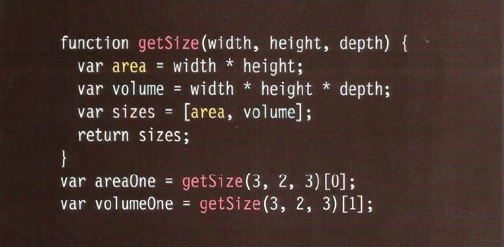

# **HTML Links**
* Links are created using the < a > element.
* The < a > element uses the ***href*** attribute to indicate the page you are linking

* When you link to a different website, the value of the href attribute will be the full web address for the site, which is known as an absolute URL.

* When you are linking to other pages within the same site, you do not need to specify the domain name in the URL. You can use a shorthand known as a relative URL.

* To create a link that starts up the user's email program and addresses an email to a specified email address, you use the < a > element. However, this time the value of the href attribute starts with mailto: and is followed by the email address you want the email to be sent to.

* If you want a link to open in a new window, you can use the target attribute on the opening < a > tag. The value of this attribute should be _blank.

* You can use the ***id*** attribute to target elements within a page that can be linked to.

# **Layout**

* CSS treats each HTML element as if it is in its own box. This box will either be a block-level box or an inline box.

* If one block-level element sits inside another block-level element then the outer box is known as the containing or parent element.
 
* ### How does CSS controll in page layout 
    * 1- **Normal flow** : Every block-level element appears on a new line, causing each item to appear lower down the page than the previous one.
    * 2- **Relative Positioning** : This moves an element from the position it would be in normal flow, shifting it to the top, right, bottom, or left of where it would have been placed.
    * 3- **Absolute positioning** : This positions the elementin relation to its containing element. It is taken out of normal flow. Absolutely positioned elements move as users scroll up and down the page.
* ### What is Box offset?
    it is properties to tell the browser how far from the top or bottom and left or right it should be placed. 

    * ##### Types of box offset 
        * 1- **Fixed Positioning** :  This is a form of absolute positioning that positions the element in relation to the browser window, as opposed to the containing element.

        * 2- **Floating Elements** : Floating an element allows you to take that element out of normal flow and position it to the far left or right of a containing box.
        

# **Function**
Functions let you group a series of statements together to perform a specific task. If different parts of a script repeat the same task, you can reuse the function (rather than repeating the same set of st atements).
  * ## Function Declarations
  Earlier in this tutorial, you learned that functions are declared with the following syntax:

   

   * Somtimes you don't need parameter this retun to the problem that use function to solve it 
   * return value indicate to the data type of function. if function does'nt have return value you can not used it as value of variable 

   * ## Function Calling 
   A JavaScript function is executed when "something" invokes it (calls it).

   

   * if function has parameter in decleration you should send parameter when you call it.

   * somtimes we need function return array 

   

# **Pair Programming**

 **pair programming** is the practice of two developers sharing a single workstation to interactively tackle a coding task together.

* ### How does pair programming work?

* #### 1- The Driver
    **The Driver** is the programmer who is typing and the only one whose hands are on the keyboard. Handling the “mechanics” of coding, the Driver manages the text editor, switching files, version control, and—of course writing—code. 
* #### 2- The Navigator
    **The Navigator** uses their words to guide the Driver but does not provide any direct input to the computer. The Navigator thinks about the big picture, what comes next, how an algorithm might be converted in to code, while scanning for typos or bugs. 

* ### Why pair program?
    * ##### 1- Greater efficiency
        Research indicates that pair programing takes slightly longer, but produces higher-quality code that doesn’t require later effort in troubleshooting and debugging (let alone exposing users to a broken product). Researches also identified pairing enhances technical skills, team communication, and even enjoyability of coding in the workplace.

    * ##### 2- Engaged collaboration
        It is harder to procrastinate or get off track when someone else is relying on you to complete the work. Another important aspect of learning to program is knowing when to ask for help. When developers pair program, they rely more on each other and can often find a solution together without needing to ask for additional help. Ultimately, this boosts overall confidence.

    * ##### 3-  Learning from fellow students
       If one developer has a unique approach to a specific problem, pair programming exposes the other developer to a new solution. The less experienced developer benefits from the experienced developer’s knowledge and guidance, and the latter benefits from explaining the topic in their own words, further solidifying their own understanding.

    * ##### 4- Social skills 
        When working with someone who has a different coding style, communication is key. Pair programming not only improves programming skills, but can also help programmers develop their interpersonal skills. When just grabbing the keyboard and taking over isn’t an option, getting good at finding the right words is a skill unto itself.

    * ##### 5- Job interview readiness
        For most roles, the ability to work with and learn from others and stellar communication skills are as (or more!) important to a company than specific technical skills. Pair programming strengthens all of those skills.

    * ##### 6- Work environment readiness
        Many companies that utilize pair programing expect to train fresh hires from CS-degree programs on how they operate to actually deliver a product. 

