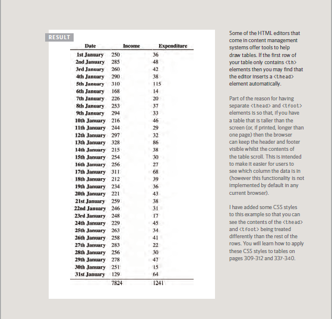

# **Object-Oriented Programming, HTML Tables**

#### **What is Table?**
A table represents information in a grid format
### **How to Create table??**
* ##### Basic table structure

th: table header
tr :table row
td : table feild or column

* #### Spanning Rows

* #### Long Tables

* #### Old Code: Width & Spacing

* #### Old Code: Border & Background

