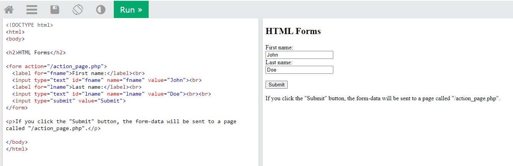
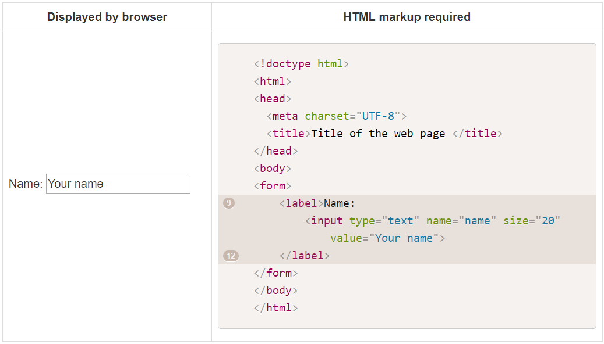
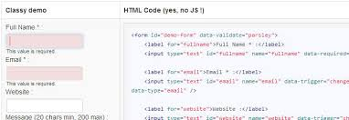
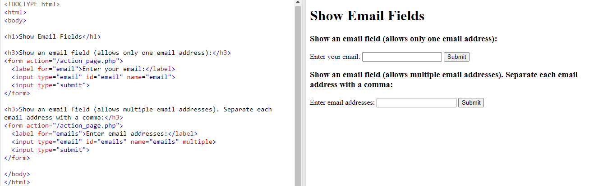

# **Forms and JS Events**
## HTML Form Structur 
 - The HTML < form > element is used to create an HTML form for user input

### Text Input
- The < input > tag specifies an input field where the user can enter data.

- The < input > element is the most important form element.

- The < input > element can be displayed in several ways, depending on the type attribute.

### Password Input
 - < input type="password" >

### Text Area 
 - The ***textarea*** element is used to create a mutli-line text input. Unlike other input elements this is not an empty element. It should therefore have an opening and a closing tag.

### Radio Button
  - Radio buttons allow users to pick just one of a number of options.

### Checkbox 
  - Checkboxes allow users to select (and unselect) one or more options in answer to a question.

 

### Drop Down List Input
 - A drop down list box (also known as a select box) allows users to select one option from a drop down list. The < select > element is used to create a drop down list box. It contains two or more < option > elements.

### Multiple select Box

### File Input Box
 - If you want to allow users to upload a file (for example an image, video, mp3, or a PDF), you will need to use a file input box.

### Submit Button
 - The submit button is used to send a form to the server.

### Image Button
 - f you want to use an image for the submit button, you can give the type attribute a value of image. The src, width, height, and alt attributes work just like they do when used with the < img > element 

### Labelling Form Controls
  - When introducing form controls, the code was kept simple by indicating the purpose of each one in text next to it. However, each form control should have its own <label> element as this makes the form accessible to vision-impaired users.
  -The ***for*** attribute states which form control the label belongs to. Note how the radio buttons use the id attribute. The value of the id attribute uniquely identifies an element from all other elements on a page.

 

### Grouping Form Elements
  - You can group related form controls together inside the < fieldset > element. This is particularly helpful for longer forms.
  - The < legend> element can come directly after the opening < fieldset> tag and contains a caption which helps identify the purpose of that group of form controls.

 
### Form Validation

### Date Input 

### Email and URL Input

### HTML 5: Search Input

### bullet Point Styles (list-style-type)
 - The list-style-type property allows you to control the shape or style of a bullet point (also known as a marker). It can be used on rules that apply to the < ol >, < ul >, and < li > elements.

 

### Images for Bullets (list-style-image)
 - You can specify an image to act as a bullet point using the list-style-image property.
 - The value starts with the letters url and is followed by a pair of parentheses. Inside the parentheses, the path to the image is given inside double quotes.
 - This property can be used on rules that apply to the < ul > and < li > elements.

 

### positioning the Marker (list-style-position)
 - Lists are indented into the page by default and the list-styleposition property indicates whether the marker should appear on the inside or the outside of the box containing the main points.

 

### List Shorthand (list-style)
 - As with several of the other CSS properties, there is a property that acts as a shorthand for list styles. It is called list-style, and it allows you to express the markers' style, image and position properties in any order.
 
### Table Properties

### Border on Empty Cells 
 - If you have empty cells in your table, then you can use the empty-cells property to specify whether or not their borders should be shown.
 - Since browsers treat empty cells in different ways, if you want to explicitly show or hide borders on any empty cells then you should use this property.
 - values : show,hide ,intial and inherit 

### Gaps Between Cells (border-spacing, border-collapse)
 - border-spacing

 

 - border-collapse

 

### Cursor Style
- The cursor property allows you to control the type of mouse cursor that should be displayed
to users.

