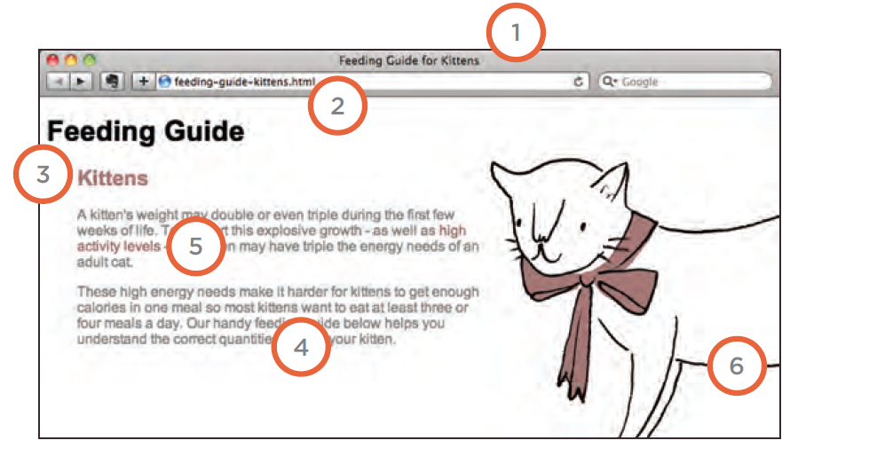

# **CSS Images**
* ### Image Size in CSS
 * You can control the size of an image using the width and height properties in CSS.

 

* ### Aligning images using CSS
  The ***float*** Property is using to align images 

  

* ### Centering images Using CSS
  * there are two common ways in which you can horizontally center an image:
  - 1-  On the containing element, you can use the text-align property with a value of center.
  - 2- On the image itself, you can use the use the margin property and set the values of the left and right margins to auto.

* ### Background Images (background-image)
  - The background-image property allows you to place an image behind any HTML element. This could be the entire page or just part of the page. By default, a background image will repeat to fill the entire box.

  

* ### Repeating Images (background-repeat , background-attachment)

* ##### image repate example

* ##### image attachment example 

* ### Background Position(background-position)
 - When an image is not being repeated, you can use the background-position property to specify where in the browser window the background image should be placed. This property usually has a pair of values. The first represents the horizontal position and the second represents the vertical.

 

# **Practical Information**

 * ### Search Engine Optimization (SEO)
  - Search engine optimization h XX elps visitors find your sites when using search engines
  - ##### 1-  On-page SEO
    - In every page of your website there are seven key places where keywords (the words people might search on to find your site) can appear in order to improve its findability.
    (Page Title, URL / Web Address,  Headings, Text, Link Text, Image Alt Text, Page Descriptions )
    

* ### How to Identify Keywords and Phrases
 - Determining which keywords to use on your site can be one of the hardest tasks when you start to think about SEO. Here are six steps that will help you identify the right keywords and phrases for your site. (Brainstorm, Organize, Research, Compare, Refine, Map)

* ### Analytics tools (Google Analytics) 
  - allow you to see how many people visit your site, how they find it, and what they do when they get there.
  - The overview page gives you a snapshot of the key information you are likely to want to know. In particular, it tells you how many people are coming to your site.

* ### Domain Names and  Hosting
    -  To put your site on the web, you will need to obtain a domain name and web hosting.
    - **domain name** is your web address (e.g. google.com or bbc.co.uk).
    - **Web Hosting** or Web servers are special computers that are constantly connected to the Internet. They are specially set up to serve web pages when they are requested.

* ### FTP and Third Party Tools
    - To transfer your code and images from your computer to your hosting company, you use something known as **File Transfer Protocol(FTP)**.
    - FTP applications: FileZilla, FireFTP, CuteFTP, SmartFTP, Transmit
    - Popular third party tools: Blogs, E-commerce, Email newsletters, Social networking and sharing buttons

