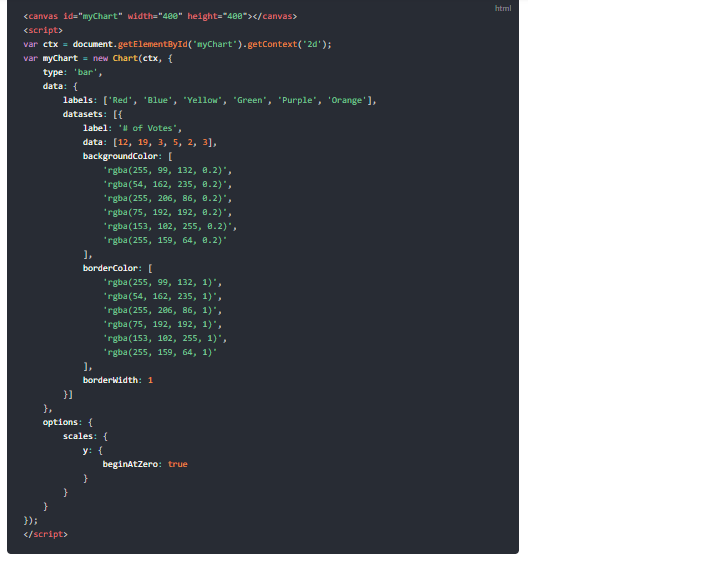

# **Chart.js, Canvas**
### How to Create Chart in JavaScript 
 - All that's required is the script included in your page along with a single < canvas > node to render the chart.

### Chart Types
The type of Chart can choosen by type attribute of canvas. the chart types are :
 - ##### 1- Bar Chart 
 

 - ##### 2- Line Chart
 

 - ##### 3- Pie Chart
 

## **Canvas Element**
 - The < canvas > element creates a fixed-size drawing surface that exposes one or more rendering contexts, which are used to create and manipulate the content shown. In this tutorial, we focus on the 2D rendering context. Other contexts may provide different types of rendering; for example, WebGL uses a 3D context based on OpenGLES

 - The canvas is initially blank. To display something, a script first needs to access the rendering context and draw on it. The < canvas > element has a method called getContext(), used to obtain the rendering context and its drawing functions.
 - for example :
    *var canvas = document.getElementById('tutorial');*
    *var ctx = canvas.getContext('2d');*

## Drawing shapes with canvas
  * ##### 1- Drawing rectangles
    - There are three functions that draw rectangles on the canvas:
    - *fillRect(x, y, width, height)*:Draws a filled rectangle.
    - *strokeRect(x, y, width, height)* :Draws a rectangular outline.
    - *clearRect(x, y, width, height)* : Clears the specified rectangular area, making it fully transparent.

  * ##### 2- Drawing paths
    -  A path, or even a subpath, can be closed. To make shapes using paths, we take some extra steps:
    - 1- First, you create the path.
        - ***beginPath()***: Creates a new path. Once created, future drawing commands are directed into the path and used to build the path up.
        - ***Path methods*** : Methods to set different paths for objects.
        - ***closePath()*** : Adds a straight line to the path, going to the start of the current sub-path.
    - 2- Then you use drawing commands to draw into the path.
        - ***stroke()*** : Draws the shape by stroking its outline.
    - 3- Once the path has been created, you can stroke or fill the path to render it.
        - ***fill()*** : Draws a solid shape by filling the path's content area.
  * ##### 3- Drawing Line
    - For drawing straight lines, use the ***lineTo()*** method. ***lineTo(x, y)*** Draws a line from the current drawing position to the position specified by x and y.

  * ##### 4- Drawing Arcs
   - To draw arcs or circles, we use the arc() or arcTo() methods.
   - ***arc(x, y, radius, startAngle, endAngle, counterclockwise)*** Draws an arc which is centered at (x, y) position with radius r starting at startAngle and ending at endAngle going in the given direction indicated by counterclockwise (defaulting to clockwise).

  - ***arcTo(x1, y1, x2, y2, radius)*** Draws an arc with the given control points and radius, connected to the previous point by a straight line.
  * ##### 5- Drawing text
    - The canvas rendering context provides two methods to render text:
    - 1- ***fillText(text, x, y [, maxWidth])*** : Fills a given text at the given (x,y) position. Optionally with a maximum width to draw.
    - 2- ***strokeText(text, x, y [, maxWidth])*** : Strokes a given text at the given (x,y) position. Optionally with a maximum width to draw.
## Applying styles and colors
* ### Color 
    - Up until now we have only seen methods of the drawing context. If we want to apply colors to a shape, there are two important properties we can use: fillStyle and strokeStyle.
    - 1- ***fillStyle = color*** : Sets the style used when filling shapes.
    - 2- ***strokeStyle = color*** : Sets the style for shapes' outlines.
* ### Line styles
    * here are several properties which allow us to style lines.
    - 1- ***lineWidth = value***: Sets the width of lines drawn in the future.
    - 2- ***lineCap = type***: Sets the appearance of the ends of lines.
    - 3- ***lineJoin = type***: Sets the appearance of the "corners" where lines meet.
    - 4- ***miterLimit = value*** :Establishes a limit on the miter when two lines join at a sharp angle, to let you control how thick the junction becomes.
    - 5- ***getLineDash()*** : Returns the current line dash pattern array containing an even number of non-negative numbers.
    - 6- ***setLineDash(segments)*** : Sets the current line dash pattern.
    - 7- ***lineDashOffset = value***: Specifies where to start a dash array on a line.
* ### Gradients
    - We create a CanvasGradient object by using one of the following methods:
    - 1- ***createLinearGradient(x1, y1, x2, y2)*** : Creates a linear gradient object with a starting point of (x1, y1) and an end point of (x2, y2).
    - 2- ***createRadialGradient(x1, y1, r1, x2, y2, r2)*** : Creates a radial gradient. The parameters represent two circles, one with its center at (x1, y1) and a radius of r1, and the other with its center at (x2, y2) with a radius of r2.
    - 3 ***createConicGradient(angle, x, y)*** : Creates a conic gradient object with a starting angle of angle in radians, at the position (x, y).
* ### Patterns
 - ***createPattern(image, type)*** : Creates and returns a new canvas pattern object. image is a CanvasImageSource (that is, an HTMLImageElement, another canvas, a < video > element, or the like. type is a string indicating how to use the image.
 - The type specifies how to use the image in order to create the pattern, and must be one of the following string values:
    - **1- repeat** : Tiles the image in both vertical and horizontal directions.
    - **2- repeat-x** : Tiles the image horizontally but not vertically.
    - **3- repeat-y** : Tiles the image vertically but not horizontally.
    - **4- no-repeat** : Doesn't tile the image. It's used only once.
* ### Shadows
- Using shadows involves just four properties:
    - 1- ***shadowOffsetX = float*** : Indicates the horizontal distance the shadow should extend from the object. This value isn't affected by the transformation matrix. The default is 0.
    - 2- ***shadowOffsetY = float*** : Indicates the vertical distance the shadow should extend from the object. This value isn't affected by the transformation matrix. The default is 0.
    - 3- ***shadowBlur = float*** : Indicates the size of the blurring effect; this value doesn't correspond to a number of pixels and is not affected by the current transformation matrix. The default value is 0.
    - 4- ***shadowColor = color*** : A standard CSS color value indicating the color of the shadow effect; by default, it is fully-transparent black.
* ### Styling text
 - There are some more properties which let you adjust the way the text gets displayed on the canvas:
    - 1- ***font = value*** : The current text style being used when drawing text. This string uses the same syntax as the CSS font property. The default font is 10px sans-serif.
    - 2- ***textAlign = value*** : Text alignment setting. Possible values: start, end, left, right or center. The default value is start.
    - 3- ***textBaseline = value*** : Baseline alignment setting. Possible values: top, hanging, middle, alphabetic, ideographic, bottom. The default value is alphabetic.
    - 4- ***direction = value*** : Directionality. Possible values: ltr, rtl, inherit. The default value is inherit.