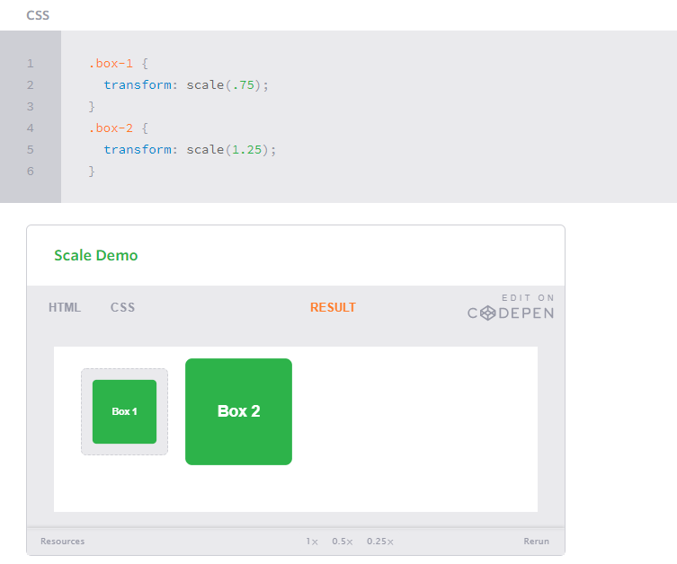
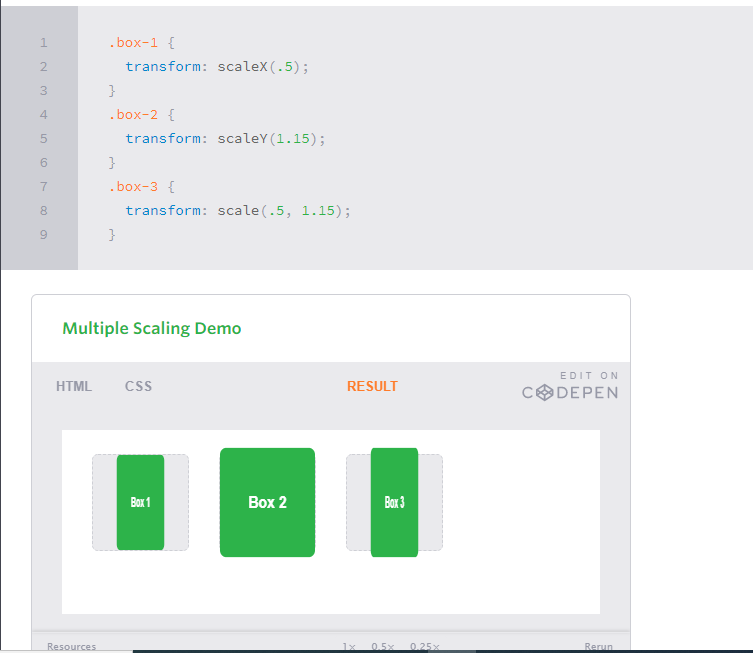
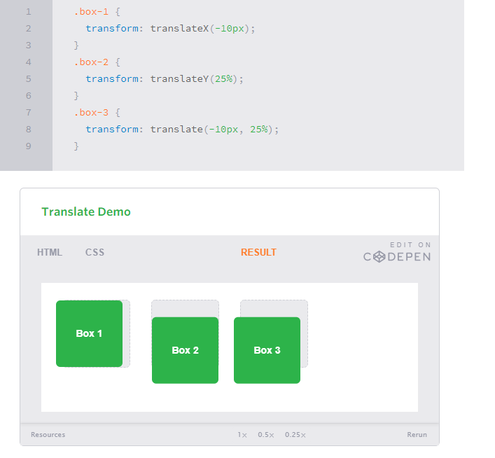
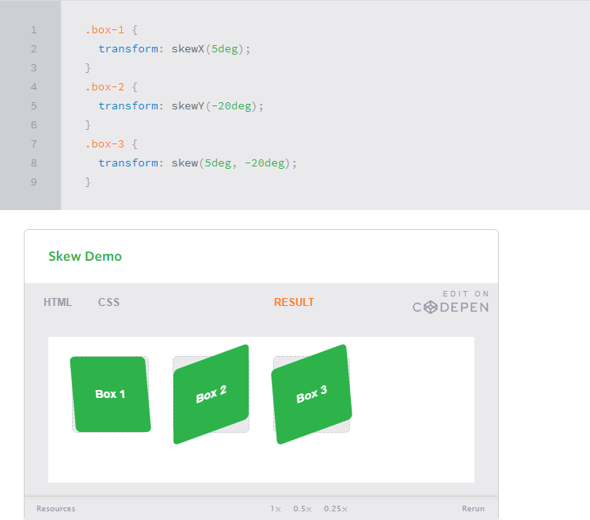
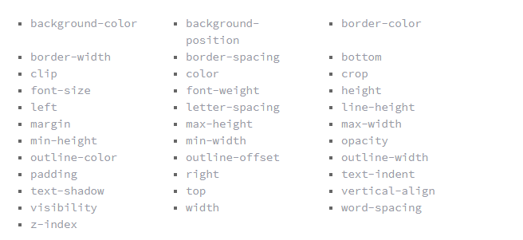

# **CSS Transform , Transitions and Animations**
# CSS Ttansform
  - general layout techniques can be revisited with alternative ways to size, position, and change elements. All of these new techniques are made possible by the transform property.
   - The transform property comes in two different settings, two-dimensional and three-dimensional. 
### Transform Syntax
  - The actual syntax for the transform property is quite simple, including the transform property followed by the value. The value specifies the transform type followed by a specific amount inside parentheses.
 *  ***div {***
  ***-webkit-transform: scale(1.5);***
     ***-moz-transform: scale(1.5);***
       ***-o-transform: scale(1.5);***
          ***transform: scale(1.5)}***

### 2D Transforms 
* #### 1- 2D Rotate
  - The rotate value provides the ability to rotate an element from 0 to 360 degrees. Using a positive value will rotate an element clockwise, and using a negative value will rotate the element counterclockwise. 

* #### 2- 2D Scale
 - Using the scale value within the transform property allows you to change the appeared size of an element. 
 

 - It is possible to scale only the height or width of an element using the scaleX and scaleY values.
 - To scale both the height and width of an element but at different sizes, the x and y axis values may be set simultaneously. To do so, use the scale transform declaring the x axis value first, followed by a comma, and then the y axis value.

 

* #### 3- 2D Translate
  - The translate value works a bit like that of relative positioning, pushing and pulling an element in different directions without interrupting the normal flow of the document. Using the translateX value will change the position of an element on the horizontal axis while using the translateY value will change the position of an element on the vertical axis.
  - As with the scale value, to set both the x and y axis values at once, use the translate value and declare the x axis value first, followed by a comma, and then the y axis value.

  - The distance values used within the translate value may be any general length measurement, most commonly pixels or percentages. Positive values will push an element down and to the right of its default position while negative values will pull an element up and to the left of its default position.

  

* ### 4- 2D Skew
  - The last transform value in the group, skew, is used to distort elements on the horizontal axis, vertical axis, or both.Using the skewX value distorts an element on the horizontal axis while the skewY value distorts an element on the vertical axis. To distort an element on both axes the skew value is used, declaring the x axis value first, followed by a comma, and then the y axis value.%p

  - The distance calculation of the skew value is measured in units of degrees. Length measurements, such as pixels or percentages, do not apply here.

# Transitions
 - an element must have a change in state, and different styles must be identified for each state. The easiest way for determining styles for different states is by using the :hover, :focus, :active, and :target pseudo-classes.

 - **Transitional Properties**

 

 * ##### Transition Duration
    - The duration in which a transition takes place is set using the transition-duration property. The value of this property can be set using general timing values, including seconds (s) and milliseconds (ms). These timing values may also come in fractional measurements, .2s for example.
   - you can see this examle (https://codepen.io/shayhowe/pen/BGmdv)
 * ##### Transition Timing
   - The transition-timing-function property is used to set the speed in which a transition will move. Knowing the duration from the transition-duration property a transition can have multiple speeds within a single duration. A few of the more popular keyword values for the transition-timing-function property include linear, ease-in, ease-out, and ease-in-out.
   - The linear keyword value identifies a transition moving in a constant speed from one state to another.
   - The ease-in value identifies a transition that starts slowly and speeds up throughout the transition, while the ease-out value identifies a transition that starts quickly and slows down throughout the transition. 
 * ##### Transition Delay
   - On top of declaring the transition property, duration, and timing function, you can also set a delay with the transition-delay property. The delay sets a time value, seconds or milliseconds, that determines how long a transition should be stalled before executing. As with all other transition properties, to delay numerous transitions, each delay can be declared as comma separated values.

# Animations
 Transitions do a great job of building out visual interactions from one state to another, and are perfect for these kinds of single state changes. However, when more control is required, transitions need to have multiple states. In return, this is where animations pick up where transitions leave off.
 * #### Animations Keyframes
  - To set multiple points at which an element should undergo a transition, use the @keyframes rule. The @keyframes rule includes the animation name, any animation breakpoints, and the properties intended to be animated.

 -  ***@keyframes slide {***
  ***0% {***
    ***left: 0;***
    ***top: 0;***
  ***}***
  ***50% {***
    ***left: 244px;***
    ***top: 100px;***
  ***}***
  ***100% {***
    ***left: 488px;***
    ***top: 0;***
  ***}***
***}***

- you can see this example (https://codepen.io/shayhowe/pen/hIpFr)

* ##### Animation Name
  - the animation-name property is used with the animation name, identified from the @keyframes rule, as the property value. The animation-name declaration is applied to the element in which the animation is to be applied to.
  ***.stage:hover .ball {***
  ***.animation-name: slide;***
***}***

* ##### Animation Duration, Timing Function, & Delay
   - A timing function and delay can be declared using the animation-timing-function and animation-delay properties respectively. The values for these properties mimic and behave just as they do with transitions.

   - The animation below should cause the ball to bounce once while moving to the left, however only when hovering over the stage.
   - you can see the example (https://codepen.io/shayhowe/pen/fochl)

* ##### Animation Iteration
  - By default, animations run their cycle once from beginning to end and then stop. To have an animation repeat itself numerous times the animation-iteration-count property may be used. Values for the animation-iteration-count property include either an integer or the infinite keyword. Using an integer will repeat the animation as many times as specified, while the infinite keyword will repeat the animation indefinitely in a never ending fashion.
  ***animation-iteration-count: infinite;***
* ##### Animation Direction
  - On top of being able to set the number of times an animation repeats, you may also declare the direction an animation completes using the animation-direction property. Values for the animation-direction property include normal, reverse, alternate, and alternate-reverse.
  - The normal value plays an animation as intended from beginning to end.
  - The alternate value will play an animation forwards then backwards
  - The reverse value will play the animation exactly opposite as identified within the @keyframes rule, thus starting at 100% and working backwards to 0%.
  - the alternate-reverse value combines both the alternate and reverse values, running an animation backwards then forwards. 

  ***animation-direction: alternate;***
* ##### Animation Play State
  - The animation-play-state property allows an animation to be played or paused using the running and paused keyword values respectively. When you play a paused animation, it will resume running from its current state rather than starting from the very beginning again.

    ***animation-play-state: paused;***
* ##### Animation Fill Mode
  - The animation-fill-mode property identifies how an element should be styled either before, after, or before and after an animation is run. The animation-fill-mode property accepts four keyword values, including none, forwards, backwards, and both.
  - The none value will not apply any styles to an element before or after an animation has been run.
  - The forwards value will keep the styles declared within the last specified keyframe. These styles may, however, be affected by the animation-direction and animation-iteration-count property values, changing exactly where an animation ends.
  - The backwards value will apply the styles within the first specified keyframe as soon as being identified, before the animation has been run. This does include applying those styles during any time that may be set within an animation delay. The backwards value may also be affected by the animation-direction property value.
  - the both value will apply the behaviors from both the forwards and backwards values.
   ***animation-fill-mode: forwards;***

