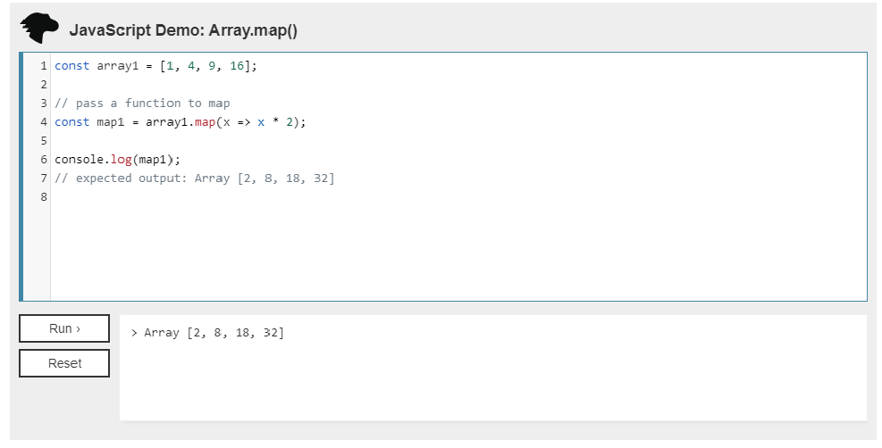
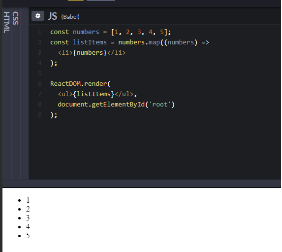
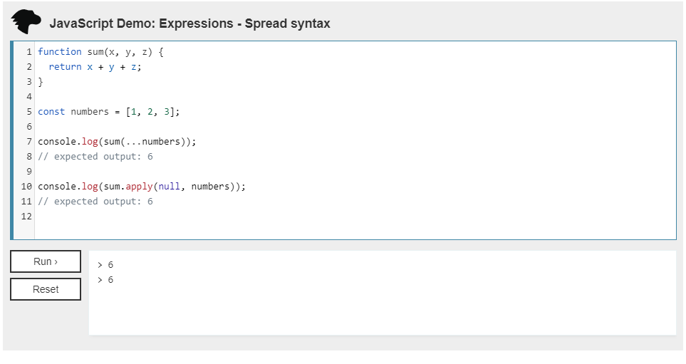

# Passing Functions as Props
## Lists and Keys
* #### What does .map() return?
    The map() method creates a new array populated with the results of calling a provided function on every element in the calling array.
    

* #### If I want to loop through an array and display each value in JSX, how do I do that in React?
 - You can build collections of elements and include them in JSX using curly braces {}.
 - We include the entire listItems array inside a <ul> element, and render it to the DOM.

 

* #### List Items
 - it need to  a **key** when create for list items
 - A **key** is a special string attribute you need to include when creating lists of elements.
 - example : https://codepen.io/gaearon/pen/jrXYRR?editors=0011
 - Keys help React identify which items have changed, are added, or are removed. Keys should be given to the elements inside the array to give the elements a stable identity
 - The best way to pick a key is to use a string that uniquely identifies a list item among its siblings. Most often you would use IDs from your data as keys

* ## Spread Operator
* #### What is the spread operator?
    Spread syntax (...) allows an iterable such as an array expression or string to be expanded in places where zero or more arguments (for function calls) or elements (for array literals) are expected, or an object expression to be expanded in places where zero or more key-value pairs (for object literals) are expected.
    

* #### What can the spread operator do?
    - 1- Spread syntax can be used when all elements from an object or array need to be included in a list of some kind.
    - 2- It is commonly used when you want to add a new item to a local data store, or display all stored items plus a new addition.
    Copying an array
    - 3- Concatenating or combining arrays
    - 4- Using Math functions
    - 5-Using an array as arguments
    - 6-Adding an item to a list
    - 7-Adding to state in React
    - 8-Combining objects
    - 9-Converting NodeList to an array
* #### How does the spread operator use to combine two arrays

    

* #### How does the spread operator use to add a new item to an array?
    

* #### How does the spread operator use to combine two objects into one?
    

##  passing functions between components

* #### In the video, what is the first step that the developer does to pass functions between components?
    - creating a callback function in the Parent which takes the data to send from the Child1 component

* #### what does the increment function do?
    it increase the count of people that has the same name if the person allow the change 

* #### How can you pass a method from a parent component into a child component?
    We can  use **props** in ReactJs to make the child inherit properties from its parent component.
* #### How does the child component invoke a method that was passed to it from a parent component?
    - using **this** keyword 
    

