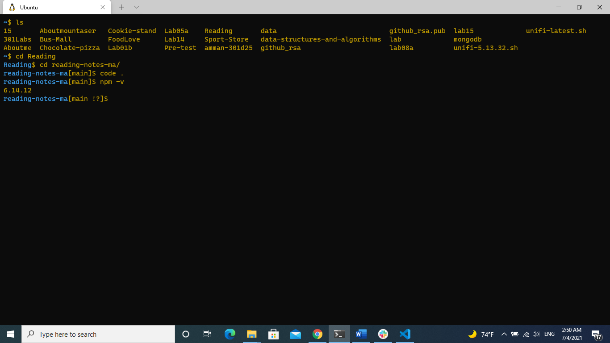

# **NODE.JS and Pair Programming**
# NODE.JS
* ### What is node.js?
    **Node.js** is a JavaScript runtime built on Chrome’s V8 JavaScript engine that is an event-based, non-blocking, asynchronous I/O runtime that uses Google’s V8 JavaScript engine and libuv library.
* ### In your own words, what is Chrome’s V8 JavaScript Engine?
    **Chrome’s V8 JavaScript Engineis** is an open-source JavaScript engine that was designed with performance in mind and is responsible for compiling JavaScript directly to native machine code that your computer can execute and runs in Google Chrome and other Chromium-based web browsers, including Brave, Opera, and Vivaldi. It .

* ### What does it mean that node is a JavaScript runtime?
    This means that Node.js is a program we can use to execute JavaScript on our computers not  in a browser.

* ### What is npm?
     npm is  the world’s largest software registry that is a package manager that the node comes bundled with it 

* ### What version of node are you running on your machine?
    By typing ***node -v*** on my machine I am having **v12.22.1** as version of node 
    

* ### What version of npm are you running on your machine?
    By typing ***npm -v*** on my machine I am having **6.14.12** as version of npm 
    
* ### What command would you type to install a library/package called ‘jshint’?
    ***npm install -g jshint*** : This will install the jshint package globally on your system

* ### What is node used for?
    - They can be used for anything from bundling your JavaScript files
    -  dependencies into static assets
    - to running tests
    - or automatic code linting and style checking
# Pair Programming
* ### What are the 6 reasons for pair programming?

    - **1- Greater efficiency** : when two people focus on the same code base, it is easier to catch mistakes in the making
    - **2- Engaged collaboration** :  It is harder to procrastinate or get off track when someone else is relying on you to complete the work. When developers pair program, they rely more on each other and can often find a solution together without needing to ask for additional help. Ultimately, this boosts overall confidence.
    - **3- Learning from fellow students** : Often times, the developers in a pairing have different skill sets. If one programmer is more experienced in a certain skill, they can teach a student who is less familiar with that area.
    - **4 - Social skills** : When just grabbing the keyboard and taking over isn’t an option, getting good at finding the right words is a skill unto itself.
    - **5- Job interview readiness** : A common step in many interview processes involves pair programming between a current employee and an applicant, either in person or through a shared screen. They will carry out exercises together, such as code challenges, building a project or feature, or debugging an existing code base.
    - **6- Work environment readiness** : Many companies that utilize pair programing expect to train fresh hires from CS-degree programs on how they operate to actually deliver a product.

* ### In your experience, which of these reasons have you found most beneficial?
    Greater efficiency , engaged collaboration , Learning from fellow students and Social skills
* ### How does pair programming work?
    Pair programming commonly involves two roles: the Driver and the Navigator. The Driver is the programmer who is typing and the only one whose hands are on the keyboard. Handling the “mechanics” of coding, the Driver manages the text editor, switching files, version control, and—of course writing—code. The Navigator uses their words to guide the Driver but does not provide any direct input to the computer. The Navigator thinks about the big picture, what comes next, how an algorithm might be converted in to code, while scanning for typos or bugs. The Navigator might also utilize their computer as a second screen to look up solutions and documentation, but should not be writing any code.