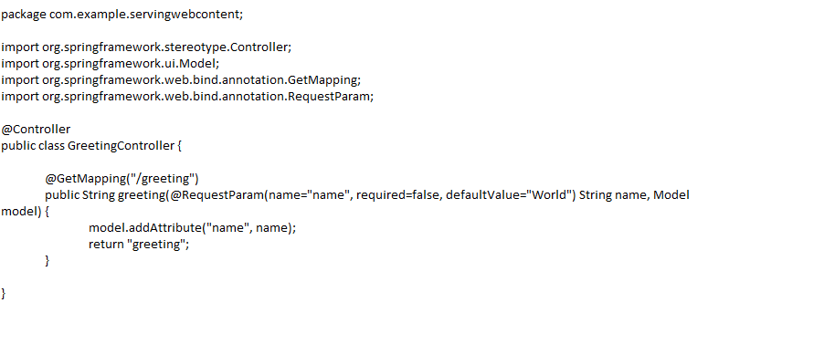
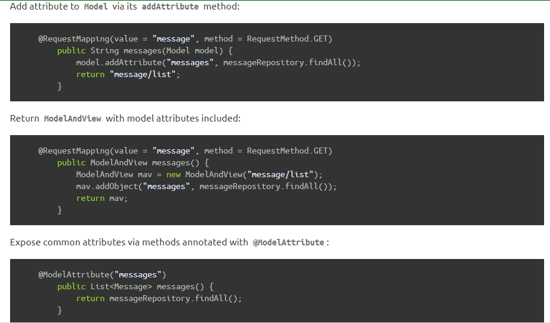
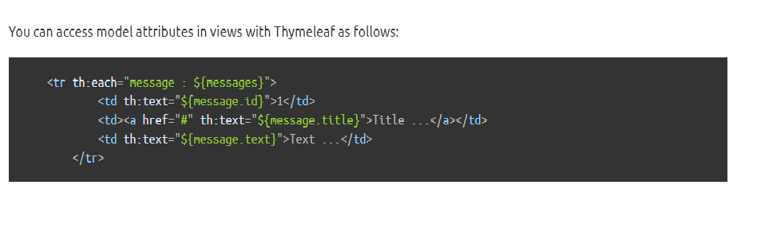

# Spring
# Serving Web Content with Spring MVC
* ### Create a Web Controller
 In Spring’s approach to building web sites, HTTP requests are handled by a controller. You can easily identify the controller by the @Controller annotation.
 

- ***The @GetMapping annotatio*** n ensures that HTTP GET requests to /greeting are mapped to the greeting() method.

- ***@RequestParam*** binds the value of the query string parameter name into the name parameter of the greeting() method. This query string parameter is not required. If it is absent in the request, the defaultValue of World is used. The value of the name parameter is added to a Model object, ultimately making it accessible to the view template.

- The implementation of the method body relies on a view technology (in this case, Thymeleaf) to perform server-side rendering of the HTML. Thymeleaf parses the greeting.html template and evaluates the th:text expression to render the value of the ${name} parameter that was set in the controller.The following listing (from src/main/resources/templates/greeting.html) shows the greeting.html template:

* ### Spring Boot Devtools
 A common feature of developing web applications is coding a change, restarting your application, and refreshing the browser to view the change. This entire process can eat up a lot of time. To speed up this refresh cycle, Spring Boot offers with a handy module known as spring-boot-devtools. Spring Boot Devtools:
 - Enables hot swapping.
 - Switches template engines to disable caching.
 - Enables LiveReload to automatically refresh the browser.
 - Other reasonable defaults based on development instead of production.

* ### Run the Application
    - The Spring Initializr creates an application class for you. In this case, you need not further modify the class provided by the Spring Initializr.

    - ***@SpringBootApplication*** is a convenience annotation that adds all of the following:

        - ***@Configuration:*** Tags the class as a source of bean definitions for the application context.

        - ***@EnableAutoConfiguration:*** Tells Spring Boot to start adding beans based on classpath settings, other beans, and various property settings. For example, if spring-webmvc is on the classpath, this annotation flags the application as a web application and activates key behaviors, such as setting up a DispatcherServlet.

        - ***@ComponentScan:*** Tells Spring to look for other components, configurations, and services in the com/example package, letting it find the controllers.

    - The main() method uses Spring Boot’s SpringApplication.run() method to launch an application. Did you notice that there was not a single line of XML? There is no web.xml file, either. This web application is 100% pure Java and you did not have to deal with configuring any plumbing or infrastructure.
* ### Build an executable JAR
    - If you use Gradle, you can run the application by using ./gradlew bootRun. Alternatively, you can build the JAR file by using ./gradlew build and then run the JAR file, as follows:
    
    ***java -jar build/libs/gs-serving-web-content-0.1.0.jar***

    - If you use Maven, you can run the application by using ./mvnw spring-boot:run. Alternatively, you can build the JAR file with ./mvnw clean package and then run the JAR file, as follows:
    ***java -jar target/gs-serving-web-content-0.1.0.ja***

* ### Test the Application
    - to the web site is running, visit http://localhost:8080/greeting, where you should see “Hello, World!”

    - Provide a name query string parameter by visiting http://localhost:8080/greeting?name=User. Notice how the message changes from “Hello, World!” to “Hello, User!”:

    - This change demonstrates that the @RequestParam arrangement in GreetingController is working as expected. The name parameter has been given a default value of World, but it can be explicitly overridden through the query string.

* ### Add a Home Page
    - Static resources, including HTML and JavaScript and CSS, can be served from your Spring Boot application by dropping them into the right place in the source code. By default, Spring Boot serves static content from resources in the classpath at /static (or /public). The index.html resource is special because, if it exists, it is used as a "`welcome page,"serving-web-content/ which means it is served up as the root resource (that is, at `http://localhost:8080/). 

# Spring MVC and Thymeleaf: how to access data from templates

In a typical Spring MVC application, @Controller classes are responsible for preparing a model map with data and selecting a view to be rendered. This model map allows for the complete abstraction of the view technology and, in the case of Thymeleaf, it is transformed into a Thymeleaf context object (part of the Thymeleaf template execution context) that makes all the defined variables available to expressions executed in templates.

* ### Spring model attributes

* ### Request parameters
    - Request parameters are passed from the client to server like:
    ***https://example.com/query?q=Thymeleaf+Is+Great!***
    
    - Let’s assume we have a @Controller that sends a redirect with a request parameter:

   ***@Controller***
        ***public class SomeController {***
            ***@RequestMapping("/")***
            ***public String redirect() {return "redirect:/query*** ***q=Thymeleaf+Is+Great!";}***
        }
    - In order to access the q parameter you can use the param. prefix: ***< p th:text="${param.q}">Test< /p>***

* ### Session attributes
  

* ### ServletContext attributes
 

* ### Spring beans
 

