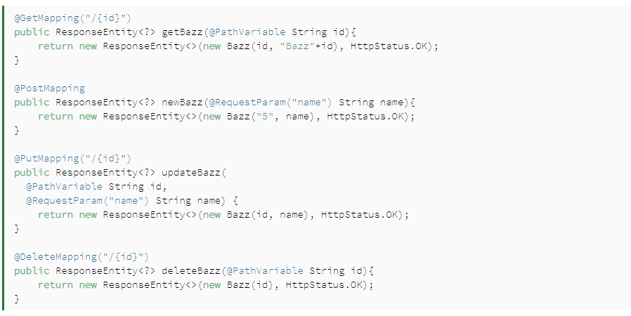

# Spring RESTful Routing & Static Files
## Spring RequestMapping
 * #### RequestMapping — by Path
    

 * #### RequestMapping — the HTTP Method
   

 * #### RequestMapping With the headers Attribute 
    ***@RequestMapping(value = "/ex/foos", headers = "key=val", method = GET)***
 * ####  RequestMapping Consumes and Produces
    ***@RequestMapping(value = "/ex/foos", method = GET, headers = "Accept=application/json")***

 * #### RequestMapping With Path Variables
    
 * #### RequestMapping With Request Parameters
    
 * #### RequestMapping Corner Cases
    - ###### RequestMapping — Multiple Paths Mapped to the Same Controller Method
        ***@RequestMapping(value = { "/ex/advanced/bars", "/ex/advanced/foos" }, method = GET)***
     - ###### RequestMapping — Multiple HTTP Request Methods to the Same Controller Method
        ***@RequestMapping(value = "/ex/foos/multiple", method = { RequestMethod.PUT, RequestMethod.POST }***
     - ###### RequestMapping — a Fallback for All Requests
       ***@RequestMapping(value = "*", method = RequestMethod.GET**
     - ######  Ambiguous Mapping Error
       

 * #### New Request Mapping Shortcuts
  
     

 * #### Spring Configuration
      

## CrudRepository ,JpaRepository, and PagingAndSortingRepository in Spring Data
 - **CrudRepository** :provides CRUD functions
 - **PagingAndSortingRepository** provides methods to do pagination and sort records
 - **JpaRepository** provides JPA related methods such as flushing the persistence context and delete records in a batch

 ####  typical CRUD functionality:
 - ***save(…)*** – save an Iterable of entities. Here, we can pass multiple objects to save them in a batch
 - ***findOne(…)*** – get a single entity based on passed primary key value
 - ***findAll()*** – get an Iterable of all available entities in database
 - ***count()*** – return the count of total entities in a table
 - ***delete(…)*** – delete an entity based on the passed object
 - ***exists(…)*** – verify if an entity exists based on the passed primary key value

 #### JpaRepository methods :
 - ***findAll()*** – get a List of all available entities in database
 - **findAll(…)** – get a List of all available entities and sort them using the provided condition
 - ***save(…)*** – save an Iterable of entities. Here, we can pass multiple objects to save them in a batch
 - ***flush()*** – flush all pending task to the database
 - ***saveAndFlush(…)*** – save the entity and flush changes immediately
 - ***deleteInBatch(…)*** – delete an Iterable of entities. Here, we can pass multiple objects to delete them in a batch

