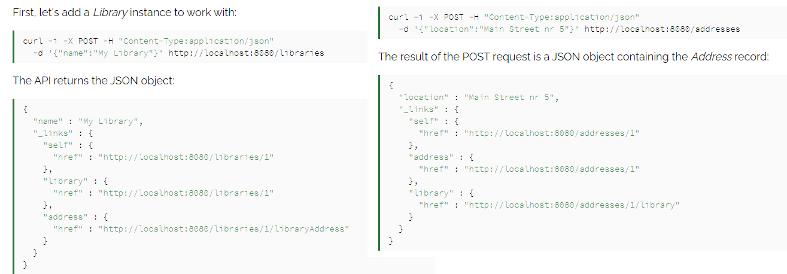

# Related Resources and Integration Testing
## Working with Relationships in Spring Data REST
* ### One-to-One Relationship
    - ##### The Data Model
    

    - ##### The Repositories
        - ***public interface LibraryRepository extends CrudRepository< Library, Long> {}***
        - ***public interface AddressRepository extends CrudRepository< Address, Long> {}*** 
    - ##### Creating the Resources
        
    - ##### Creating the Associations
        - add an address to a library:
        ***curl -i -X PUT -d "http://localhost:8080/addresses/1" -H "Content-Type:text/uri-list" http://localhost:8080/libraries/1/libraryAddress***

        - check the library association resource of the address:
        ***curl -i -X GET http://localhost:8080/addresses/1/library***
        - making sure to use the association resource of the owner of the relationship:
        ***curl -i -X DELETE http://localhost:8080/libraries/1/libraryAddress***

* ### One-to-Many Relationship
    - ##### The Data Model
         
         

    - ##### The Repositories
        - ***public interface BookRepository extends CrudRepository< Book, Long> { }***
    - ##### Creating the Associations
        - create a Book instance first by using the /books collection resource:
        ***curl -i -X POST -d "{\"title\":\"Book1\"}" -H "Content-Type:application/json" http://localhost:8080/books***
        - PUT request to the association resource that contains the URI of the library resource:
        ***curl -i -X PUT -H "Content-Type:text/uri-list" -d "http://localhost:8080/libraries/1" http://localhost:8080/books/1/library***
        - verify the books in the library by using GET method on the library's /books association resource:
        ***curl -i -X GET http://localhost:8080/libraries/1/books***
        -  remove an association, we can use the DELETE method on the association resource:
        ***curl -i -X DELETE http://localhost:8080/books/1/library***
* ### Many-to-Many Relationship
    - ##### The Data Model
         
         

    - ##### The Repositories
        - ***public interface AuthorRepository extends CrudRepository< Author, Long> { }***
    - ##### Creating the Associations
        - POST requests to the /authors collection resource:
        ***curl -i -X POST -H "Content-Type:application/json" -d "{\"name\":\"author1\"}" http://localhost:8080/authors***

        - add a second Book record to our database:
        ***curl -i -X POST -H "Content-Type:application/json" -d "{\"title\":\"Book 2\"}" http://localhost:8080/books***
        - send multiple URIs we have to separate them by a line break:
        ***curl -i -X PUT -H "Content-Type:text/uri-list" --data-binary @uris.txt http://localhost:8080/authors/1/books***
        -  verify both books have been associated with the author, we can send a GET request to the association endpoint:
        ***curl -i -X GET http://localhost:8080/authors/1/books***
        - remove an association, we can send a request with DELETE method to the URL of the association resource followed by {bookId}:
        ***curl -i -X DELETE http://localhost:8080/authors/1/books/1***

## Integration Testing in Spring
* ### Spring test dependencies:
    
* ### Spring MVC Test Configuration
    - ##### Enable Spring in Tests with JUnit 5
    
    - ##### The WebApplicationContext Object
        ***@Autowired***
        ***private WebApplicationContext webApplicationContext;***
    - ##### Mocking Web Context Beans
    
    - ##### Verify Test Configuration
            @Test
            public void givenWac_whenServletContext_thenItProvidesGreetController() {
                 ServletContext servletContext = webApplicationContext.getServletContext();
                 Assert.assertNotNull(servletContext);
                 Assert.assertTrue(servletContext instanceof MockServletContext);
                 Assert.assertNotNull(webApplicationContext.getBean("greetController"));
                 }

* ### Writing Integration Tests
    - ##### Verify View Name
            http://localhost:8080/spring-mvc-test/

            @Test
            public void givenHomePageURI_whenMockMVC_thenReturnsIndexJSPViewName() {
            this.mockMvc.perform(get("/homePage")).andDo(print())
           .andExpect(view().name("index"));
           }
    - ##### Verify Response Body
        - We'll invoke the /greet endpoint from our test as:

                http://localhost:8080/spring-mvc-test/greet
        - The expected output will be:

                {
                "id": 1,
                "message": "Hello World!!!"
                }
        - Let's see the test code:

                @Test
                public void givenGreetURI_whenMockMVC_thenVerifyResponse() {
                MvcResult mvcResult = this.mockMvc.perform(get("/greet"))
                .andDo(print()).andExpect(status().isOk())
                .andExpect(jsonPath("$.message").value("Hello World!!!"))
                .andReturn();
    
                Assert.assertEquals("application/json;charset=UTF-8", 
                 mvcResult.getResponse().getContentType());
                    }

    - ##### Send GET Request With Path Variable
        - invoke the /greetWithPathVariable/{name} endpoint from our test as:

                http://localhost:8080/spring-mvc-test/greetWithPathVariable/John

        - The expected output will be:

                {
                    "id": 1,
                    "message": "Hello World John!!!"
                }
        - Let's see the test code:

                @Test
                public void givenGreetURIWithPathVariable_whenMockMVC_thenResponseOK() {
                    this.mockMvc
                    .perform(get("/greetWithPathVariable/{name}", "John"))
                    .andDo(print()).andExpect(status().isOk())
                    
                    .andExpect(content().contentType("application/json;charset=UTF-8"))
                    .andExpect(jsonPath("$.message").value("Hello World John!!!"));
                }

    - ##### Send GET Request With Query Parameters
        - invoke the /greetWithQueryVariable?name={name} endpoint from our test as:

                http://localhost:8080/spring-mvc-test/greetWithQueryVariable?name=John%20Doe

        - the expected output will be:

                {
                    "id": 1,
                    "message": "Hello World John Doe!!!"
                }

        -  the test code:

                @Test
                public void givenGreetURIWithQueryParameter_whenMockMVC_thenResponseOK() {
                    this.mockMvc.perform(get("/greetWithQueryVariable")
                    .param("name", "John Doe")).andDo(print()).andExpect(status().isOk())
                    .andExpect(content().contentType("application/json;charset=UTF-8"))
                    .andExpect(jsonPath("$.message").value("Hello World John Doe!!!"));
                }
    - ##### Send POST Request
    -  invoke the /greetWithPost endpoint from our test as:
                         
            http://localhost:8080/spring-mvc-test/greetWithPost

    -  output:

            {
                "id": 1,
                "message": "Hello World!!!"
            }
    - And  test code is:

                @Test
                public void givenGreetURIWithPost_whenMockMVC_thenVerifyResponse() {
                    this.mockMvc.perform(post("/greetWithPost")).andDo(print())
                    .andExpect(status().isOk()).andExpect(content()
                    .contentType("application/json;charset=UTF-8"))
                    .andExpect(jsonPath("$.message").value("Hello World!!!"));
                }