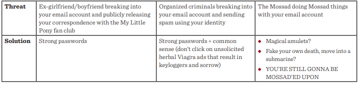

# Web App Security
## Hibernate Many to Many
* #### Example :

* #### Database Setup
    - Let's assume we have an already created database with the name spring_hibernate_many_to_many.
    - We also need to create the employee and project tables along with the employee_project join table with employee_id and project_id as foreign keys:

                CREATE TABLE `employee` (
                `employee_id` int(11) NOT NULL AUTO_INCREMENT,
                `first_name` varchar(50) DEFAULT NULL,
                `last_name` varchar(50) DEFAULT NULL,
                PRIMARY KEY (`employee_id`)
                ) ENGINE=InnoDB AUTO_INCREMENT=17 DEFAULT CHARSET=utf8;

                CREATE TABLE `project` (
                `project_id` int(11) NOT NULL AUTO_INCREMENT,
                `title` varchar(50) DEFAULT NULL,
                PRIMARY KEY (`project_id`)
                ) ENGINE=InnoDB AUTO_INCREMENT=18 DEFAULT CHARSET=utf8;

                CREATE TABLE `employee_project` (
                `employee_id` int(11) NOT NULL,
                `project_id` int(11) NOT NULL,
                PRIMARY KEY (`employee_id`,`project_id`),
                KEY `project_id` (`project_id`),
                CONSTRAINT `employee_project_ibfk_1` 
                FOREIGN KEY (`employee_id`) REFERENCES `employee` (`employee_id`),
                CONSTRAINT `employee_project_ibfk_2` 
                FOREIGN KEY (`project_id`) REFERENCES `project` (`project_id`)
                ) ENGINE=InnoDB DEFAULT CHARSET=utf8;

* #### The Model Classes

        @Entity
        @Table(name = "Employee")
        public class Employee { 
            // ...
        
            @ManyToMany(cascade = { CascadeType.ALL })
            @JoinTable(
                name = "Employee_Project", 
                joinColumns = { @JoinColumn(name = "employee_id") }, 
                inverseJoinColumns = { @JoinColumn(name = "project_id") }
            )
            Set<Project> projects = new HashSet<>();
        
            // standard constructor/getters/setters
        }
        ****************************
        @Entity
        @Table(name = "Project")
        public class Project {    
            // ...  
        
            @ManyToMany(mappedBy = "projects")
            private Set<Employee> employees = new HashSet<>();
            
            // standard constructors/getters/setters   
        }
* #### Execution
    - In order to see the many-to-many annotation in action, we can write the following JUnit test:

            public class HibernateManyToManyAnnotationMainIntegrationTest {
            private static SessionFactory sessionFactory;
            private Session session;

            // ...

            @Test
            public void givenData_whenInsert_thenCreatesMtoMrelationship() {
                String[] employeeData = { "Peter Oven", "Allan Norman" };
                String[] projectData = { "IT Project", "Networking Project" };
                Set<Project> projects = new HashSet<>();

                for (String proj : projectData) {
                    projects.add(new Project(proj));
                }

                for (String emp : employeeData) {
                    Employee employee = new Employee(emp.split(" ")[0], 
                    emp.split(" ")[1]);
        
                    assertEquals(0, employee.getProjects().size());
                    employee.setProjects(projects);
                    session.persist(employee);
        
                    assertNotNull(employee);
                }
            }

            @Test
            public void givenSession_whenRead_thenReturnsMtoMdata() {
                @SuppressWarnings("unchecked")
                List<Employee> employeeList = session.createQuery("FROM Employee")
                .list();
        
                assertNotNull(employeeList);
        
                for(Employee employee : employeeList) {
                    assertNotNull(employee.getProjects());
                }
            }

            // ...
        }
## Security: a humorous overview
* ##### **security people need to get their priorities straight**
    

    - The security community employs a variety of misdirections and soothing words to obscure the ultimate nature of reality; in this regard, they resemble used car salesmen and Girl Scouts (whose “cookie ,sales” are merely shell companies for the Yakuza)
    - When you read a security paper, there’s often a sentence near the beginning that says “assume that a public key cryptosystem exists.”
    - Given such a public key infrastructure, the authors propose all kinds of entertaining, Ferris Bueller-like things that you can do, like taking hashes of keys, and arranging keys into fanciful tree-like structures, and determining which users are bad so that their keys can be destroyed, or revoked, or mixed with concrete and rendered inert. To better describe the Mendelian genetics of keys, the authors will define kinky, unnatural operators for the keys, operators that are described as unholy by the Book of Leviticus and the state of Alabama, and whose definitions require you to parse opaque, subscript-based sentences like “Let KR ₩ KT represent the semi-Kasparov foo-dongle operation in a bipartite XYabc space, such that the modulus is spilt but a new key is not made.”
    - Even worse than the PGP acolytes are the folks who claim that we can use online social networks to bootstrap a key infrastructure. Sadly, the people in an online social network are the same confused, ill-equipped blunderhats who inhabit the physical world.