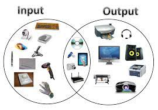
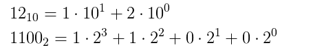
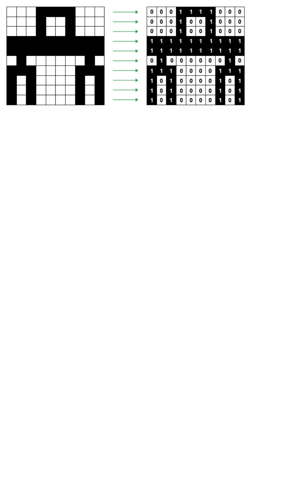

# **How Does a Computer Work?**
**A computer** is a machine (hardware) that receives and processes data according to the instructions given to it, and after the data has been processed, the results of the processing are usually sent to an output device.

* both the old and new  comuterize systems  work with these four parts(Input==> ٍStorage ==> processing ==> Output)
* The following figur show the input and output devices of Computer

# **Binary System**
**Binary System** is a system used to implement any system with two output such (on,off)(true,false)(zero,one) that
Computer uses  for reading and processing of information
* The smallest Piece of information in Binary called the **Bit**
* A complex information can be implemented by more bits
* Any number can be represented by a sequence of bits (binary digits), which in turn may be represented by any mechanism capable of being in two mutually exclusive states. for example to implement the **12** in Binary :

* # Text, Images and Audios in Binary
 ### 1-  Text in Binary
 When any key on a keyboard is pressed, it needs to be converted into a binary number so that it can be processed by the computer and the typed character can appear on the screen. for example can you implement **A** Letter as 
 **A=0100 0001**

 ### 2- Images in Binary
 Images also need to be converted into binary in order for a computer to process them so that they can be seen on our screen. Digital images are made up of pixels. Each pixel in an image is made up of binary numbers.
 
  This tool lets you combine Red, Green, and Blue light to make any RGB color. The sliders control the saturation levels of each color component, ranging from 0 (none) to 255 (full saturation).
 The slider value (saturation level) of each pure color component is shown in the side rectangles.The center shows the resulting RGB color - the combination of the Red, Green, and Blue light.

 ### 3- Audios in Binary
  sound is captured - usually by a microphone - and then converted into a digital signal

# Circuit and Logic
A logic gate is an idealized model of computation or physical electronic device implementing a Boolean function, a logical operation performed on one or more binary inputs that produces a single binary output.

The arthmaic oparations can achive by logical Circuit called Adder

###### *one bit Adder*

# ** What is CPU**
**A central processing unit (CPU)**, also called a central processor, main processor or just processor, is the electronic circuitry that executes instructions comprising a computer program. The CPU performs basic arithmetic, logic, controlling, and input/output (I/O) operations specified by the instructions in the program

* ### CPU instruction
A instruction set  provides commands to the processor, to tell it what it needs to do.(ADD, compair, IN , OUT,...)

* ### Multi-CPU System
Multiprocessing is the use of two or more central processing units (CPUs) within a single computer system.The term also refers to the ability of a system to support more than one processor or the ability to allocate tasks between them.

# Software
Software, commonly known as programs or apps, consists of all the instructions that tell the hardware how to perform a task.
# Oparating system
An Operating System (OS) is an interface between a computer user and computer hardware. An operating system is a software which performs all the basic tasks like file management, memory management, process management, handling input and output, and controlling peripheral devices such as disk drives and printers.

Some popular Operating Systems include Linux Operating System, Windows Operating System, VMS, OS/400, AIX, z/OS, etc

