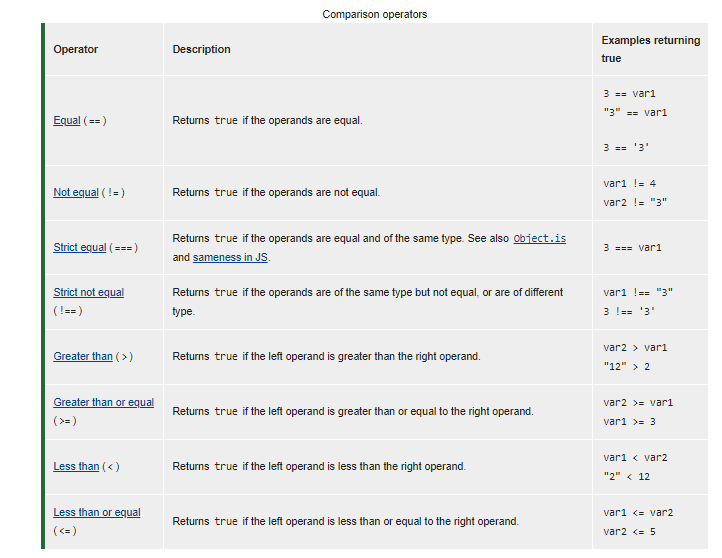

## **comparison operator: Evaluating Condition**
A comparison operator compares its operands and returns a logical value based on whether the comparison is true. The operands can be numerical, string, logical, or object values. Strings are compared based on standard lexicographical ordering, using Unicode values. In most cases, if the two operands are not of the same type, JavaScript attempts to convert them to an appropriate type for the comparison. This behavior generally results in comparing the operands numerically.
