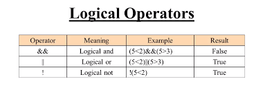

## **comparison operator: Evaluating Condition**
A comparison operator compares its operands and returns a logical value based on whether the comparison is true. The operands can be numerical, string, logical, or object values. Strings are compared based on standard lexicographical ordering, using Unicode values. In most cases, if the two operands are not of the same type, JavaScript attempts to convert them to an appropriate type for the comparison. This behavior generally results in comparing the operands numerically.

# **Logical Operators**
Logical operators are typically used with Boolean (logical) values; when they are, they return a Boolean value. 

# **Loops**
  * #### For Loops
    A for loop repeats until a specified condition evaluates to false

  * Operations planner of For Loop 
  

  * For Loop Example 
  
  
  * #### While Loops
    A while statement executes its statements as long as a specified condition evaluates to true. 
  * Operations planner of While Loop
  

  * While Loop Example
  

        