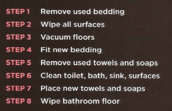

# **JavaScrtipt: Expresion and Oparator and Function**
# **Introduction**
* ### How JavaScrtipt makes web pages more interactive
  * **1- Accsess Content**
  You can use JavaScript to select any element, attribute, or text from an HTML page
  * **2- Modify Content**
  You can use JavaScript to add elements, attributes, and text to the page, or remove them.
  * **3- Programming Rules**
  You can specify a set of steps for the browser to follow (like a recipe), which allows it to access or change the content of a page.

  * **4- React to Event**
  You can specify that a script should run when a specific event has occurred. For example, it could be run when: A button is pressed,  A link is clicked (or tapped) on or  A web page has finished loading.

# **What is A script**
A script is a series of instructions that a computer can follow to achieve a goal.

To write a script, you need to first state your goal and then list the tasks that need to be completed in order to achieve it.

Start with the big picture of what you want to achieve, and break that down into smaller steps.

## Designing A script steps

# **Expression**
An expression evaluates into (results in) a single value. Broadly speaking there are two types of expressions.
  * 1- Expression that just assign a value to a variable:ex 
  *var color = 'beige';*
  
  * 2- Expression  that use two  or more values ro return a single value.EX:
   *var area = 3 * 2;*

# **Operators**
Expressions rely on things called operators; they allow programmers to create a single value from one or more values.
 
  

# **Function**
Functions let you group a series of statements together to perform a specific task. If different parts of a script repeat the same task, you can reuse the function (rather than repeating the same set of st atements).
  * ## Function Declarations
  Earlier in this tutorial, you learned that functions are declared with the following syntax:
   

   * ## Function Calling 
   A JavaScript function is executed when "something" invokes it (calls it).
   
   

