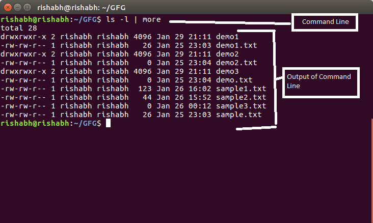
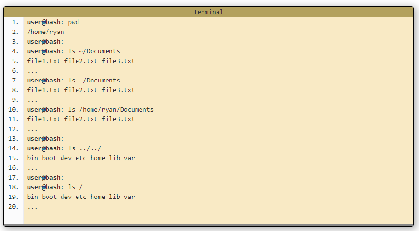

# **Choosing A Text Editor**
## **What is a text editor?**
A text editor is a piece of software that you download and install on your computer, or you access online through your web browser, that allows you to write and manage text especially the text that you write to build a web site.
* ### **The Featurs of Text Editor**
  * #### **1- code completion**
      Code completion allows you to start typing, and the code completion feature will display possible suggestions based on what you originally typed. This saves you time by providing a choice, rather than allowing you to finish typing and possibly encounter typos.
  * #### **2- Syntax highlighting**
      is a feature that takes the text you type, and makes it more noticeable by colorizing the text
  * #### **3- series of themes**
       A themes will allow you to change the color of the background of your text editor, the series of colors in your text, and sometimes themes will affect other aspects of your text editing software as well.

  * #### **4- Extensions**
      Extensions are like plugins for your text editor, that allow you to have superpowers that you wouldn’t have otherwise. A text editor that has a great selection of extension will ensure that you have the ability to add functionality as you need it.

      
      *Text Editor Featurs*

* # **Using The Software That Already Comes With Your Computer**

| Oparating System | Text Editor|
| ---------------- | ---------- |
| Mac OS | Text Edit|
| Windows | Notepad |
| Linux | Gedite|

* #### **Please make sure that when you use the text editor that comes on your computer**
  * 1-You should not see options for making text bold, underlined, or italic. ** *Plain text has no formatting options* **
  * 2- you should Choose the file location that is the same for all files of your website 
  * 3- you should Choose the file extension
** *The text editor that Comes on your computer is no code completion and no Syntax highlighting* **
# ** Third-Party Options **
it is  text editors can all be downloaded and installed to your computer from their respective websites.

| Text Editor | Oparating System | Description |
| ----------- | ---------------- | ----------- |
| Notepad++ | Windows | It has syntax highlighting and code completion, as well as word completion and function completion.| 
|TextWrangler/BB Edit | Mac OS | TextWrangler is for Mac computers only, and you used to be able to download it from the Mac App Store |
| Visual Studio Code | Windows, Mac and Linux | VS Code has the Emmet shorthand for HTML and CSS already built-in with no additional work from you at all.|
| Atom |  Windows, Mac and Linux | Atom is brought to you by the folks at GitHub .|
| Brackets | Windows, Mac and Linux | It is only supports HTML, CSS and JavaScript, though more coding capabilities can be added through extensions.|
| Sublime Text | Windows, Mac and Linux | Sublime Text 3 is a premium software that can be purchased in full for $70.|

# **IDE (Integrated Development Environment)**
It is really a suite of different software all coming together. An IDE is a text editor, a file manager, a compiler, and a debugger all in one software package

# **The Command Line (Terminal)**
A command line, or terminal, is a text based interface to the system. You are able to enter commands by typing them on the keyboard and feedback will be given to you similarly as text.
The command line typically presents you with a prompt. As you type, it will be displayed after the prompt. Most of the time you will be issuing commands.
example : 

* **Opening a terminal**  

  * 1- If you're on a Mac then you'll find the program Terminal under Applications -> Utilities. An easy way to get to it is the key combination 'command + space' which will bring up Spotlight, then start typing Terminal and it will soon show up.

  * 2-If on Linux then you will probably find it in Applications -> System or Applications -> Utilities. Alternatively you may be able to 'right-click' on the desktop and there may be an option 'Open in terminal'.

  * 3-If you are on Windows and intend to remotely log into another machine then you will need an SSH client. A rather good one is Putty (free) 
### **shell / bash**
The **shell** is a part of the operating system that defines how the terminal will behave and looks after running (or executing) commands for you. 
There are various shells available but the most common one is called **bash** which stands for Bourne again shell.

# **Basic Navigation**
  -  The first command we are going to learn is pwd which stands for Print Working Directory.

  
  - It's one thing to know where we are. Next we'll want to know what is there. The command for this task is ls. It's short for list. Let's give it a go.

  
* ### **Absolute and Relative Paths**
  * Absolute paths specify a location (file or directory) in relation to the root directory. You can identify them easily as they always begin with a forward slash ( / )

  * Relative paths specify a location (file or directory) in relation to where we currently are in the system. They will not begin with a slash.

### more Paths
  * 1- ~ (tilde) :This is a shortcut for your home directory. eg, if your home directory is /home/ryan then you could refer to the directory Documents with the path /home/ryan/Documents or ~/Documents
 * 2- . (dot) : This is a reference to your current directory. eg in the example above we referred to Documents on line 4 with a relative path. It could also be written as ./Documents (Normally this extra bit is not required but in later sections we will see where it comes in handy).
 * 3- .. (dotdot): This is a reference to the parent directory. You can use this several times in a path to keep going up the hierarchy. eg if you were in the path /home/ryan you could run the command ls ../../ and this would do a listing of the root directory.
 

# **Files in Linux**
 * ### There are three extenssion of files 
   * file.exe - an executable file, or program.
   * file.txt - a plain text file.
   * file.png, file.gif, file.jpg - an image.
 * Linux is ***Case Sensetive*** for files name 
 * If file name contains one or more spaces , it find it in two ways :
    * 1- Quotes : ***cd 'Holiday Photos'***
    * 2- Escape : ***cd Holiday\ Photos***

